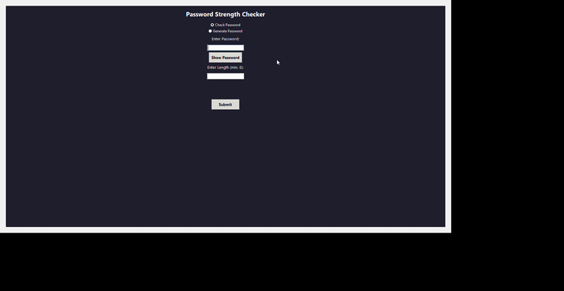

# Password Strength Checker

A Python desktop application to check password strength and generate secure passwords.

---

## Features

- Checks password strength (Weak / Medium / Strong)
- Identifies missing character types (Uppercase, Lowercase, Number, Special Character)
- Generate secure random passwords (minimum 8 characters)
- Show / Hide password toggle
- Blocks spaces on live input
- Color-coded results (red / orange / green)
- Logs all results to 'results.txt' with timestamps
- Follows NIST guidelines - no arbitrary maximum length

---

## Versions

|---|---|
| v1 | Basic strength checker, length validation, Weak/Medium/Strong output |
| v2 | Displays missing components, improved scoring logic |
| v3 | Added password generator, results logging to results.txt, modular structure |
| v4 | GUI interface, show/hide toggle, space blocking, removed length cap, fixed generator logic, added docstrings |

---

## How to Run

**Option 1 -- Run the executable (Windows):**

Download 'PasswordStrengthChecker.exe' and double click. No Python required.

**Option 2 -- Run from source:**

'''bash
pip install tk
python gui.py

# Built With
 - Python
 - Tkinter (GUI)
 - random, string, datetime (standard library)

# Author
Rajdeep Ganguly
